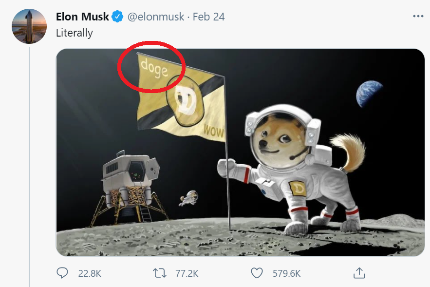

# Elonbot

Trading bot that uses Elon Musk`s tweets to know when to buy cryptocurrency. 
Here is how it works:

1. Subscribes to someone's ([elonmusk](http://twitter.com/elonmusk)?) tweets 
2. Automatically detects mentions of DOGE or other crypto in the image(or text) 

3. Buys crypto on [Binance](https://www.binance.com)
4. Sells it after `--auto-sell-delay` seconds


## Installation

```shell
git clone http://github.com/vslaykovsky/elonbot
pip install python-binance google-cloud-vision unidecode
```

## Running

1. Set up Twitter access keys. 
    * Go to [developer.twitter.com](https://developer.twitter.com/en/docs/twitter-api/getting-started/about-twitter-api) to create your developer account 
    * Generate a [bearer token](https://developer.twitter.com/en/docs/authentication/oauth-2-0/bearer-tokens)
    * Set up an environment variable with the bearer token.
      * Linux: `export TWITTER_BEARER_TOKEN="<YOUR BEARER TOKEN>"`
      * Windows: `set TWITTER_BEARER_TOKEN="<YOUR BEARER TOKEN>"`
2. Set up Binance access keys.
    * Go to [Binance](https://www.binance.com/en) and create a trader account if you don't have it yet
    * Go to [API management](https://www.binance.com/en/my/settings/api-management) page and copy your API key and secret
    * Export both keys: 
      * Linux: `export BINANCE_KEY="<your API key>"; export BINANCE_SECRET="<your secret key>"`
      * Windows: `set BINANCE_KEY="<your API key>" & export BINANCE_SECRET="<your secret key>"`
3. [Optional] Add image text recognition support with Google OCR
    * Use the [following documentation](https://cloud.google.com/vision/docs/setup) to access Google Vision API
    * Export path to your google vision configuration. 
      * Linux `export GOOGLE_APPLICATION_CREDENTIALS="/path/to/your/google_vision_credentials.json"`
      * Windows `set GOOGLE_APPLICATION_CREDENTIALS="C:\path\to\your\google_vision_credentials.json"`
4. Run elonbot.py

Here are some examples of how to run Elonbot. All examples are provided for Linux. 
For Windows make sure you use [correct escaping](https://ss64.com/nt/syntax-esc.html) 

With image text recognition:

```shell
python elonbot.py --user=elonmusk --margin-type=cross_margin  --crypto-rules='{"doge": "DOGE", "btc|bitcoin": "BTC"}' --auto-sell-delay=600  --order-size=max  --use-image-signal
```

No image text recognition
```shell
python elonbot.py --user=elonmusk --margin-type=cross_margin  --crypto-rules='{"doge": "DOGE", "btc|bitcoin": "BTC"}' --auto-sell-delay=600 --order-size=max
```

Dry run (only prints debug output, no orders are executed)

```shell
python elonbot.py --user=elonmusk --margin-type=cross_margin  --crypto-rules='{"doge": "DOGE", "btc|bitcoin": "BTC"}'  --auto-sell-delay=60 --order-size=max --dry-run
```


Get help:
```shell
(base) C:\Users\vslay\Desktop\notebooks\elon>python elonbot.py --help
usage: elonbot.py [-h] --user USER --crypto-rules CRYPTO_RULES --margin-type MARGIN_TYPE [--auto-buy-delay AUTO_BUY_DELAY] [--auto-sell-delay AUTO_SELL_DELAY] [--asset ASSET] [--use-image-signal]
                  [--order-size ORDER_SIZE] [--dry-run] [--process-tweet PROCESS_TWEET]

Trade cryptocurrency at Binance using Twitter signal

optional arguments:
  -h, --help            show this help message and exit
  --user USER           Twitter user to follow. Example: elonmusk
  --crypto-rules CRYPTO_RULES
                        JSON dictionary, where keys are regular expression patterns, values are corresponding cryptocurrency tickers. elonbot.py uses regular expressions to find tweets that mention
                        cryptocurrency,then buys corresponding crypto ticker
  --margin-type MARGIN_TYPE
                        isolated_margin or cross_margin. These are two margin types supported by Binance. Read this article to understand the difference:
                        https://www.binance.com/en/blog/421499824684900602/Binance-Margin-Differences-Between-the-New-Isolated-Margin-Mode-and-Cross-Margin-Mode. You must transfer your assets to isolated
                        margin or cross-margin to use this script
  --auto-buy-delay AUTO_BUY_DELAY
                        Buy after auto-buy-delay seconds
  --auto-sell-delay AUTO_SELL_DELAY
                        Sell after auto-sell-delay seconds
  --asset ASSET         asset to use to buy cryptocurrency. This is your "base" cryptocurrency used to store your deposit. Reasonable options are: USDT, BUSD, USDC. You must convert your deposit to one
                        of these currencies in order to use the script
  --use-image-signal    Extract text from attached twitter images using Google OCR. Requires correct value of GOOGLE_APPLICATION_CREDENTIALS environment variable.Check
                        https://github.com/vslaykovsky/elonbot for more details
  --order-size ORDER_SIZE
                        Size of orders to execute. 1.0 means 100% of the deposit; 0.5 - 50% of the deposit; 2.0 - 200% of the deposit (marginal trade)"max" - maximum borrowable amount. max corresponds to
                        3x deposit for cross-margin account and up to 5x for isolated-margin account
  --dry-run             Don't execute orders, only show debug output
  --process-tweet PROCESS_TWEET
                        Don't subscribe to Twitter feed, only process a single tweet provided as a json string (useful for testing). Example value: '{"data": {"text": "Dodge coin is not what we need"},
                        "includes": {"media": [{"url": "..."}]}}'
```
